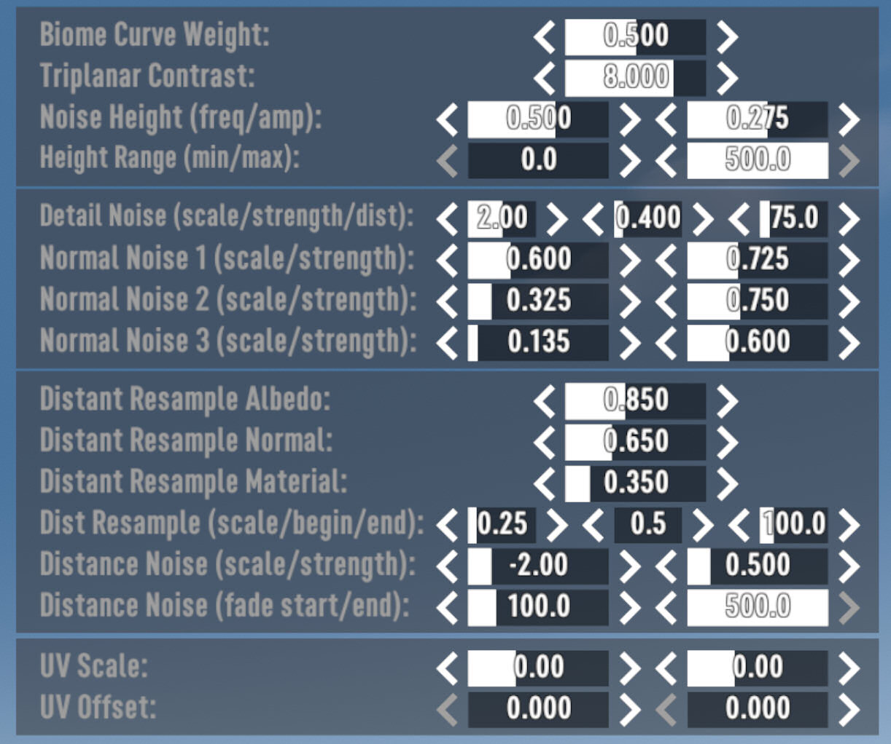
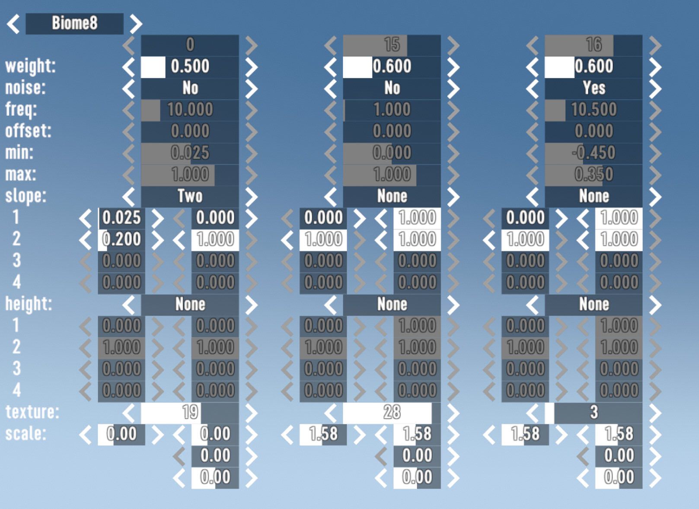

# OCB MicroSplat Helper Mod  - 7 Days to Die (V1.0) Addon

Helper Mod for OCB MicroSplat or vanilla MicroSplat.  
Adds WYSIWYG windows to edit layers or shader settings.

You need to disable EAC to use this mod!

## How to use

Bring up the console and enter commands from below.  
To use the widgets, press "ESC" to use mouse cursor.

## Command `msph layers`

Allows to edit procedural render settings for biome layers.

## Command `msph shader`

Allows to edit global MicroSplat shader settings.

## Command `msph close`

Execute to close all our open WYSIWYG widgets.

## Command `msph save`

Write biome layer settings to `Config/worldconfig.xml`.  
Requires OcbMicroSplat to load and re-use them again!

## In-Game Screenshots

## Changelog

### Version 0.2.0

- Compatibility with V1.0 (b333)

### Version 0.1.0

- Initial version

[1]: https://github.com/OCB7D2D/OcbMicroSplatHelper
[2]: https://github.com/OCB7D2D/OcbMicroSplatHelper/releases
